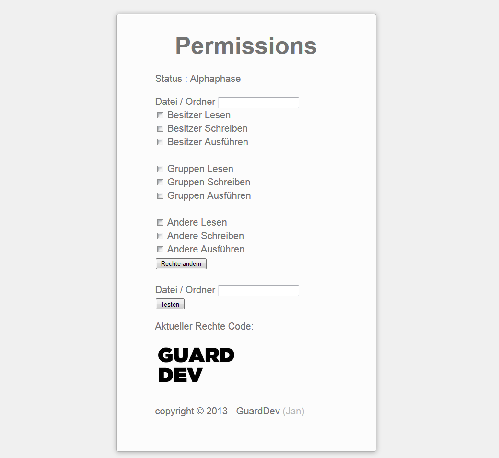

Permissions
===========

Permissions is a smart and small tool to give files or folders and Clients permissions (writing, reading).

This Tool uses the PHP command chmod() to give permissions. <br>

Here you can see the Changelogs for all Versions:  [Github Changelog](https://github.com/guard0dev/permissions/blob/master/CHANGELOG.md)

Code for chmod
``` objective-c
<?php 
chmod("$file", "$permission"); 
?>
```
For testing the PHP command fileperm() is used.<br>
Code with output command to show the result of the permission test.
``` objective-c
<?php
echo substr(sprintf('%o', fileperms($file_test)), -4);
?>
```

With this tool you can manage everything by an graphical layout.
You need only one File, to change an manage the.

UI User Interface
---



powered by GuardDev
